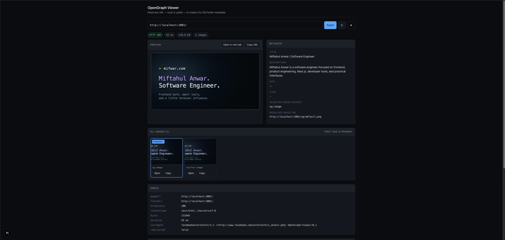

# OpenGraph Viewer

> Inspect the **Open Graph** and **Twitter Card** metadata any URL exposes.
> Built for the day-to-day: "did my Next.js `opengraph-image.tsx` actually
> render the right thing?"



[](LICENSE)
[](https://nextjs.org)
[](https://nodejs.org)
[](#dependencies)

## Why

OG meta is annoying to test. The page lives on your machine, the social crawler
lives on Facebook's machine, and the browser between them refuses to fetch
localhost over CORS. This tool sits on your machine, fetches the page with a
crawler User-Agent on your behalf, parses the meta, and shows you exactly what
a crawler would see.

## Features

- **Local + public URLs** — works against `http://localhost:3000/...` (runs
  on your box) and any public URL.
- **Crawler-style fetch** — sends `facebookexternalhit/1.1` so Next.js,
  SvelteKit, Nuxt etc. return the same meta a social platform gets.
- **Dynamic OG image support** — for Next.js `opengraph-image.tsx` /
  `ImageResponse`-generated images, the resolved image URL is fetched
  directly through the viewer's image proxy: the final rendered PNG, not the
  meta tag.
- **Multiple images** — all `og:image` / `twitter:image` occurrences are
  shown; the first is highlighted as primary.
- **Relative URL resolution** — image URLs are resolved against the final
  page URL (after redirects).
- **Debug panel** — HTTP status, final URL (post-redirect), content type,
  byte count, fetch duration, User-Agent, selected tag, resolved image URL.
- **Image proxy** — images stream through `/api/og/image` so HTTPS→HTTP
  mixed-content issues can't bite you.
- **Per-image actions** — open in new tab, copy URL.
- **Refresh** to re-fetch the same URL.
- **Dark mode** toggle, respects `prefers-color-scheme`.

## Quick start

```bash
npm install
npm run dev
```

The viewer boots on **http://localhost:4000**. Paste any URL and press
Enter.

## How it works

```
Browser  ──POST /api/og {url}──▶  Next.js route handler
                                       │
                                       ▼
                              server-side fetch (crawler UA)
                                       │
                                       ▼
                              parse <meta> + <title>
                                       │
                                       ▼
Browser  ◀──JSON { parsed, debug } ───┘
   │
   │  
   ▼
Next.js image proxy  ──fetch upstream──▶  original image bytes
```

The fetch happens in the Next.js Node runtime, so:

- `http://localhost:3000/...` works because the request never leaves your
  machine.
- Cross-origin sites don't trigger browser CORS.
- Crawler-specific markup is visible (UA = `facebookexternalhit/1.1`).

## API

### `POST /api/og`

Body: `{ "url": "https://…" }` (also accepts `GET /api/og?url=…`)

```jsonc
{
  "ok": true,
  "pageUrl": "https://…",
  "finalUrl": "https://…/after-redirect",
  "httpStatus": 200,
  "contentType": "text/html; charset=utf-8",
  "bytes": 12345,
  "fetchDurationMs": 187,
  "redirected": false,
  "userAgent": "facebookexternalhit/1.1 …",
  "parsed": {
    "title": "…",
    "description": "…",
    "siteName": "…",
    "type": "article",
    "url": "…",
    "primaryImage": { "raw": "…", "resolved": "…", "source": "og:image" },
    "primaryImageSource": "og:image",
    "images": [ /* all discovered, in document order */ ],
    "raw": { "og:title": ["…"], "twitter:title": ["…"] /* … */ },
    "warnings": []
  }
}
```

`raw` is `Record<string, string[]>` so duplicate keys (e.g. multiple
`og:image`s) survive. `images` mirrors the OG grouping order so the first
element is always the primary.

### `GET /api/og/image?url=<encoded>`

Streams the image bytes with permissive CORS. The UI uses this for ``
and the "Open in new tab" button.

## Image-source priority

1. `og:image` — with `og:image:width` / `og:image:height` / `og:image:alt` /
   `og:image:type` attached to each occurrence in document order
2. `og:image:url` (older spec variant)
3. `twitter:image` — with `twitter:image:alt` attached
4. `<link rel="image_src">` (legacy)

All four are also returned in `images` for inspection.

## Testing against a local dev server

1. Start your project (e.g. Next.js on `:3000`).
2. Start this viewer (`:4000`).
3. Paste `http://localhost:3000/blog/my-post` into the viewer.
4. The viewer fetches the page from its own Node runtime, parses the meta,
   and proxies the image back to your browser.

If you change OG markup in your project, hit ↻ in the viewer — no need to
restart it.

## Deploying

The viewer is a standard Next.js app with API routes. Anywhere that runs
Next.js works. A few notes:

### Cloudflare Pages

Works via [OpenNext](https://opennext.js.org/cloudflare):

```bash
npm i -D @opennextjs/cloudflare wrangler
npx opennextjs-cloudflare build
wrangler pages deploy
```

Two caveats:

- The API routes use `runtime = "nodejs"`. On Pages you'll need to either
  flip them to `edge` (recommended — `fetch` + `AbortController` are
  available there) or enable Cloudflare's Node compatibility mode (paid
  plans).
- Once deployed, the viewer runs at Cloudflare's edge. `localhost` from CF
  is not your machine — only public URLs will resolve. For remote
  localhost testing, front the dev server with a tunnel (ngrok,
  cloudflared, or `wrangler tunnel`).

### Anywhere else

`npm run build && npm start` on any Node 18.18+ host.

## Project structure

```
app/
├── api/
│   └── og/
│       ├── route.ts        # fetch + parse  (POST/GET)
│       └── image/
│           └── route.ts    # image proxy
├── components/
│   └── OgViewer.tsx        # client UI
├── globals.css             # light/dark + dev-tool aesthetic
├── layout.tsx              # pre-paint theme bootstrap
└── page.tsx
lib/
└── og.ts                   # OG/Twitter meta parser
```

## Dependencies

Two: [`next`](https://nextjs.org) and [`react`](https://react.dev). The HTML
meta parser in `lib/og.ts` is hand-rolled to keep the install footprint
small.

## License

[MIT](LICENSE)
